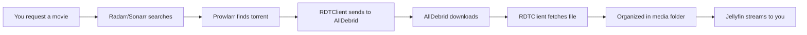

# 🎬 Automated Media Server Stack

A complete, production-ready media server setup that automatically downloads and organizes your movies and TV shows using AllDebrid, with a beautiful streaming interface powered by Jellyfin.

## 🚀 What This Does

This repository sets up a fully automated media server that:
1. **Automatically finds** movies and TV shows you want to watch
2. **Downloads them** using your AllDebrid account (no torrenting on your connection)
3. **Organizes them** into a clean library structure
4. **Streams them** to any device through a Netflix-like interface
5. **Tracks what you watch** with analytics and recommendations

## 📦 What's Included

| Service | Purpose | Port | Auto-Login |
|---------|---------|------|------------|
| **Jellyfin** | Stream your media with a Netflix-like interface | 8096 | ❌ |
| **RDTClient** | Downloads from AllDebrid to your server | 6500 | ✅ |
| **Radarr** | Automatically manages movies | 7878 | ✅ |
| **Sonarr** | Automatically manages TV shows | 8989 | ✅ |
| **Prowlarr** | Finds torrents across multiple sites | 9696 | ✅ |
| **Jellyseerr** | Request movies/shows with a nice UI | 5055 | ❌ |
| **Jellystat** | Track watching statistics | 3000 | ❌ |

## 🔄 How It Works



1. **Request**: You add a movie/show to your watchlist
2. **Search**: Radarr/Sonarr automatically searches for it
3. **Download**: RDTClient uses AllDebrid to download (not using your IP)
4. **Organize**: Files are renamed and organized properly
5. **Stream**: Watch on any device through Jellyfin

## ✅ Prerequisites

- **Docker Desktop** installed (works on Windows, Mac, Linux)
- **AllDebrid account** with active subscription
- **Storage space**: At least 100GB free (more is better)
- **RAM**: 4GB minimum, 8GB recommended
- **Internet**: Stable connection for streaming

## 🚀 Quick Start (10 minutes)

### 1️⃣ Clone & Navigate
```bash
git clone https://github.com/yourusername/media-server.git
cd media-server
```

### 2️⃣ Configure Environment
Copy the example environment file:
```bash
cp .env.example .env
```

Edit `.env` and add your AllDebrid API key:
```env
# REQUIRED: Your AllDebrid API key
ALLDEBRID_API_KEY=your_actual_api_key_here

# Optional: Change default admin credentials
ADMIN_USERNAME=admin
ADMIN_PASSWORD=admin123
```

### 3️⃣ Create Folder Structure
```bash
# Run this command to create all required folders
mkdir -p data/{downloads,media/{movies,tv}} \
         config jellyseerr \
         jellystat/{postgres,backup-data} \
         rdtclient/config \
         prowlarr radarr sonarr
```

### 4️⃣ Start Everything
```bash
docker-compose up -d
```

### 5️⃣ Access Your Services
Wait 2-3 minutes for services to initialize, then:
- **Jellyfin**: http://localhost:8096 (create admin account)
- **RDTClient**: http://localhost:6500 (login: admin/admin123)
- **Radarr**: http://localhost:7878 (no login needed)
- **Sonarr**: http://localhost:8989 (no login needed)

## 📁 Folder Structure

```
media_server/
├── 📄 docker-compose.yml    # Main configuration
├── 📄 .env                  # Your API keys and settings
├── 📄 .env.example          # Template for .env
├── 📁 data/
│   ├── 📁 downloads/        # Temporary downloads from AllDebrid
│   └── 📁 media/
│       ├── 📁 movies/       # Your movie library
│       └── 📁 tv/           # Your TV show library
├── 📁 config/               # Jellyfin configuration
├── 📁 rdtclient/            # RDTClient database
├── 📁 radarr/               # Radarr configuration
├── 📁 sonarr/               # Sonarr configuration
├── 📁 prowlarr/             # Prowlarr configuration
├── 📁 jellyseerr/           # Jellyseerr configuration
└── 📁 jellystat/            # Statistics database
```

## ⚙️ Initial Configuration

### Step 1: Configure RDTClient with AllDebrid
1. Open http://localhost:6500
2. Login with `admin` / `admin123`
3. Go to Settings → Providers
4. Select **AllDebrid** and enter your API key
5. Set download path to `/data/downloads`
6. Save settings

### Step 2: Set Up Jellyfin
1. Open http://localhost:8096
2. Create admin account
3. Add media libraries:
   - Movies: `/data/media/movies`
   - TV Shows: `/data/media/tv`
4. Complete setup wizard

### Step 3: Connect Everything
1. **Prowlarr** (http://localhost:9696):
   - Add indexers (1337x, RARBG, etc.)
   - Add Radarr/Sonarr as apps
   
2. **Radarr** (http://localhost:7878):
   - Settings → Download Clients → Add RDTClient
   - Host: `rdtclient`, Port: `6500`
   
3. **Sonarr** (http://localhost:8989):
   - Same as Radarr setup

## 🎯 Features

### ✨ Automated Everything
- **Auto-search**: Finds the best quality version available
- **Auto-download**: Uses AllDebrid (protects your privacy)
- **Auto-organize**: Renames files properly (Movie.Name.2024.1080p.mkv)
- **Auto-upgrade**: Replaces files when better quality is found
- **Auto-subtitle**: Downloads subtitles automatically

### 🔒 Privacy & Security
- **No direct torrenting**: AllDebrid handles all torrent traffic
- **Local authentication**: No login needed for local network
- **Isolated services**: Each service runs in its own container
- **Your data stays local**: Nothing leaves your server

### 📱 Multi-Device Support
- **Web browser**: Watch from any computer
- **Mobile apps**: Jellyfin apps for iOS/Android
- **TV apps**: Roku, Android TV, Apple TV, Fire TV
- **Chromecast**: Cast to any TV
- **DLNA**: Works with smart TVs

## 🔧 Common Tasks

### Adding a Movie/Show
1. **Via Jellyseerr**: Search and request (user-friendly)
2. **Via Radarr/Sonarr**: Add directly (more control)
3. **Via Prowlarr**: Manual search and send to clients

### Backup Your Setup
```bash
# Backup all configurations (not media files)
tar -czf backup-$(date +%Y%m%d).tar.gz \
    .env compose.yml \
    config/ jellyseerr/ jellystat/ \
    prowlarr/ radarr/ rdtclient/ sonarr/
```

### Update All Services
```bash
docker-compose pull
docker-compose up -d
```

### View Logs
```bash
# All services
docker-compose logs -f

# Specific service
docker-compose logs -f radarr
```

## ❓ Troubleshooting

| Problem | Solution |
|---------|----------|
| **Port already in use** | Change port in `compose.yml` or stop conflicting service |
| **Can't access web UI** | Check firewall, ensure Docker is running |
| **RDTClient not downloading** | Verify AllDebrid API key and account status |
| **Media not showing in Jellyfin** | Scan library manually, check file permissions |
| **Out of space** | Clean `/data/downloads/`, increase Docker disk space |
| **Slow streaming** | Check internet speed, reduce quality in Jellyfin |

## 🔐 Security Best Practices

1. **Change default passwords** in `.env` file
2. **Use HTTPS** with reverse proxy (Traefik/Caddy) for external access
3. **Firewall rules**: Only expose Jellyfin (8096) to the internet
4. **Regular updates**: Run `docker-compose pull` weekly
5. **Backup regularly**: Automate with cron job

## 💰 Cost Breakdown

- **AllDebrid**: ~€3/month (required)
- **Server/VPS**: €0 (your computer) or €5-20/month (cloud)
- **Domain**: €10/year (optional, for remote access)
- **Total**: ~€3-25/month for unlimited media

## 🚫 Legal Disclaimer

This software is for educational purposes. You are responsible for:
- Complying with your local laws
- Respecting copyright and content ownership
- Using legitimately obtained content only
- Your AllDebrid account usage

## 📚 Documentation

- [Full AllDebrid Setup Guide](./ALLDEBRID_SETUP.md)
- [WebDAV Configuration](./WEBDAV_SETUP.md)
- [Service Documentation](#):
  - [Jellyfin Docs](https://jellyfin.org/docs/)
  - [Radarr Wiki](https://wiki.servarr.com/radarr)
  - [Sonarr Wiki](https://wiki.servarr.com/sonarr)
  - [RDTClient GitHub](https://github.com/rogerfar/rdt-client)

## 🤝 Contributing

Contributions are welcome! Please:
1. Fork the repository
2. Create your feature branch
3. Commit your changes
4. Push to the branch
5. Open a Pull Request

## 📄 License

MIT License - See [LICENSE](LICENSE) file for details

## ⭐ Support

If this project helped you, please consider:
- Giving it a ⭐ on GitHub
- Sharing it with friends
- Contributing improvements

---

**Made with ❤️ for the self-hosting community**
